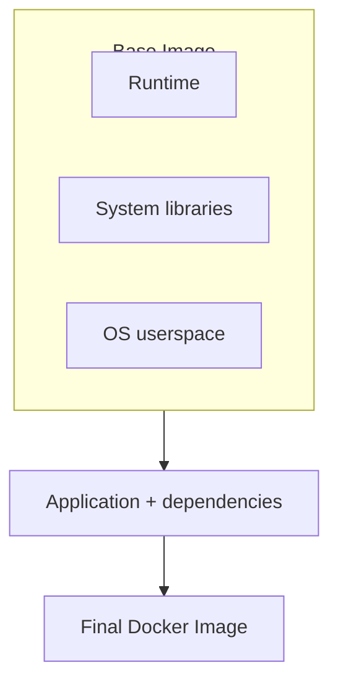
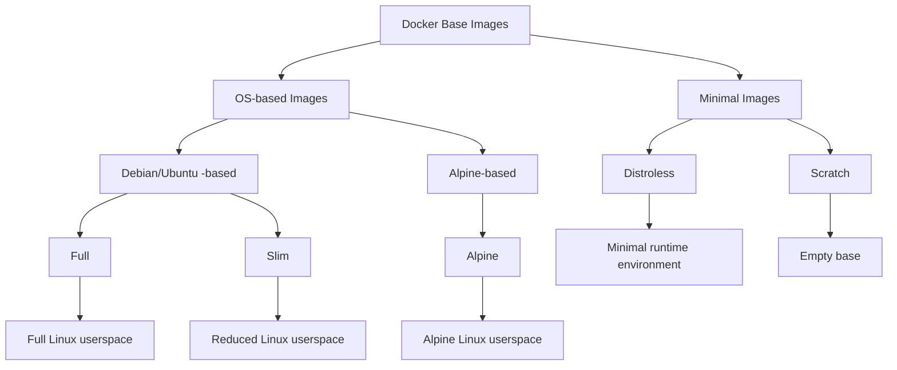

# Imágenes base de Docker explicadas: una guía completa — Parte I

Probablemente hayas visto esta línea innumerables veces en Dockerfiles para aplicaciones Node.js:

```dockerfile

FROM node:24

```

Pero ¿realmente necesitamos `node:24` cada vez que construimos una aplicación Node.js?

Quizás no.

Existen imágenes más pequeñas y minimalistas que pueden proporcionar descargas de imágenes más rápidas, despliegues más ligeros y menos componentes que mantener. Sin embargo, las imágenes más pequeñas también implican ciertas desventajas, especialmente en lo que respecta a la compatibilidad, la depuración y la experiencia de desarrollo.

Y esto nos lleva a una pregunta más interesante:

****¿Son realmente mejores las imágenes Docker más pequeñas?****

En esta serie de tres partes, recorreremos los diferentes tipos de imágenes base de Docker — desde ****Full****, ****Slim**** y ****Alpine**** hasta ****Distroless**** y ****Scratch****. Exploraremos qué proporciona cada una, cuándo tiene sentido utilizarla y qué sacrificamos a medida que avanzamos hacia un entorno más minimalista.

En ****[Parte I — Imágenes basadas en un SO](**./../blog/docker-base-images-explained-part-1**)****, veremos las imágenes ****Full****, ****Slim**** y ****Alpine****. Analizaremos el entorno Linux que hay detrás de cada una, qué componentes proporciona y los compromisos entre tamaño, compatibilidad y comodidad.

En ****[Parte II — Imágenes mínimas](**./../blog/docker-base-images-explained-part-1**)****, iremos más allá de las imágenes tradicionales basadas en un SO y exploraremos ****Distroless**** y ****Scratch****. Veremos cómo estos enfoques eliminan la mayor parte, o incluso la totalidad, del espacio de usuario tradicional del sistema operativo y qué significa esto para la compatibilidad de las aplicaciones, la seguridad y la depuración.

En ****[Parte III — Comparación y benchmarking](**./../blog/docker-base-images-explained-part-1**)****, reuniremos todo en una ****tabla comparativa**** que abarcará los cinco tipos de imágenes. Después, las pondremos a prueba mediante un ****ejercicio de benchmarking concreto****, midiendo métricas como ****el tamaño de la imagen, el tiempo de build, el tiempo de inicio y otros indicadores de rendimiento relevantes****.

Más importante aún, abordaremos la decisión desde la perspectiva de un ****ingeniero de software****. El objetivo no es simplemente encontrar la imagen más pequeña posible, sino responder a una pregunta más útil:

> ****«¿Cuál es el entorno mínimo que realmente necesita mi aplicación?»****

## ¿Qué es una imagen base de Docker?

Antes de comparar los diferentes tipos de imágenes, entendamos primero qué es realmente una ****imagen base de Docker****.

Cuando escribes:

```dockerfile

FROM node:24

```

le estás indicando a Docker desde dónde comenzar a construir tu imagen.

Una imagen base proporciona el sistema de archivos, las bibliotecas y otros componentes fundamentales a partir de los cuales se construye el resto de la imagen, incluido un runtime de aplicación cuando este se proporciona. En el caso de `node:24`, proporciona el runtime de Node.js junto con el espacio de usuario subyacente y las dependencias necesarias para ejecutar tu aplicación.

A partir de ahí, tu Dockerfile añade todo lo que necesita tu aplicación:



Pero aquí es donde las cosas se ponen interesantes:

****No todas las aplicaciones necesitan la misma cantidad de componentes en su imagen base.****

Un entorno de desarrollo puede beneficiarse de un shell, un gestor de paquetes, herramientas de depuración y otras utilidades. Un contenedor de producción, por otro lado, puede necesitar únicamente el runtime y las bibliotecas necesarias para ejecutar la aplicación.

Aquí es donde entran en juego los diferentes tipos de imágenes base.

Para los fines de este artículo, podemos clasificar aproximadamente las imágenes base de Docker más comunes en dos grandes grupos:

* ****Las imágenes basadas en un SO**** proporcionan un espacio de usuario Linux y normalmente incluyen herramientas como un shell y un gestor de paquetes. Esta categoría incluye las variantes Full, Slim y Alpine.
* ****Las imágenes mínimas**** adoptan un enfoque más agresivo al eliminar la mayor parte o la totalidad del espacio de usuario tradicional. Esto incluye las imágenes Distroless y Scratch.

No se trata de una clasificación estricta ni universalmente definida, pero proporciona una forma útil de comparar cuánto entorno proporciona cada tipo a una aplicación.



Estos tipos de imágenes generalmente avanzan hacia entornos de ejecución más pequeños y minimalistas, pero no son simplemente versiones progresivamente reducidas unas de otras. Cada enfoque presenta diferentes compromisos entre tamaño, compatibilidad, herramientas y comodidad.

Cuanto más minimalista sea la imagen, más tendremos que pensar en ****lo que nuestra aplicación realmente necesita en tiempo de ejecución****.

En las siguientes secciones, exploraremos individualmente los tres tipos de imágenes basadas en un SO, analizando qué contienen, qué dejan fuera y, lo más importante, ****cuándo tiene sentido utilizar cada una****.

## 1. Imágenes Full

Una ****imagen Full**** es una imagen base de propósito general que proporciona un espacio de usuario Linux relativamente completo junto con el runtime necesario para tu aplicación.

Por ejemplo, una aplicación Node.js podría comenzar con:

```dockerfile

FROM node:24

```

En comparación con imágenes más minimalistas, una ****imagen Full**** conserva un conjunto más amplio de herramientas y utilidades del sistema, lo que facilita el desarrollo, la inspección y la resolución de problemas dentro del contenedor.

Normalmente incluye:

* ****Un espacio de usuario Linux relativamente completo****
* ****Bibliotecas del sistema, shell y utilidades comunes****
* ****Gestor de paquetes del sistema operativo**** (como `apt` en imágenes basadas en Debian/Ubuntu)
* ****Runtime de la aplicación**** (Node.js, por ejemplo) y su ****gestor de paquetes**** asociado (npm, por ejemplo)

En el caso de una imagen de Node.js, puedes esperar encontrar el runtime de Node.js junto con un entorno subyacente basado en Debian y sus correspondientes bibliotecas y utilidades del sistema.

Esto hace que el contenedor se parezca mucho más a un entorno Linux tradicional. Puedes abrir un shell interactivo:

```bash

docker exec -it my-app sh

```

y utilizar herramientas conocidas para inspeccionar archivos, comprobar procesos, examinar logs, instalar paquetes o solucionar problemas directamente dentro del contenedor.

### Ventajas

La principal ventaja de una ****imagen Full**** es la ****comodidad****. Proporciona un entorno familiar y bien equipado con la mayoría de los componentes que los desarrolladores suelen necesitar.

* Entorno Linux familiar con amplia compatibilidad para aplicaciones y dependencias
* Depuración y resolución de problemas interactiva y sencilla
* Fácil instalación de paquetes y herramientas adicionales
* Menos problemas de compatibilidad cuando las aplicaciones esperan componentes estándar del sistema

### Desventajas

Esa comodidad tiene un coste. Incluir un gran conjunto de componentes y utilidades del sistema puede hacer que la imagen sea más pesada de lo necesario para producción.

* Mayor tamaño de imagen, lo que implica transferir más datos y potencialmente tiempos de build, push y pull más largos
* Más paquetes y componentes innecesarios que mantener y potencialmente actualizar
* Una superficie de ataque potencialmente mayor debido a la presencia de componentes adicionales

En otras palabras, una ****imagen Full**** proporciona un entorno cómodo y flexible, pero puedes terminar distribuyendo —y manteniendo— muchos más componentes de los que realmente necesita tu aplicación.

### Casos de uso

Las imágenes Full son especialmente adecuadas para:

* ****Desarrollo local****
* ****Depuración y resolución de problemas****
* Aplicaciones con ****dependencias complejas del sistema****
* Aplicaciones donde la ****compatibilidad es una prioridad****
* Situaciones en las que las dependencias necesarias en tiempo de ejecución ****todavía no se conocen por completo****

Proporcionan un entorno cómodo y flexible mientras desarrollas, pruebas y depuras tu aplicación.

En producción, una imagen Full también puede ser una opción razonable cuando ****necesitas la flexibilidad de un entorno Linux relativamente completo**** o cuando la comodidad de disponer de herramientas comunes supera los beneficios de utilizar una imagen más pequeña.

Sin embargo, una vez que las dependencias de tu aplicación se conocen bien, muchos de estos componentes adicionales pueden dejar de ser necesarios.

Esto plantea la siguiente pregunta:

> ****¿Qué pasaría si mantuviéramos la compatibilidad y la comodidad, pero elimináramos algunos de los componentes innecesarios?****

Ahí es donde entran las ****imágenes Slim****.

## 2. Imágenes Slim

Una ****imagen Slim**** es una variante reducida de una imagen Full. Mantiene los componentes principales necesarios para ejecutar la aplicación, eliminando muchos paquetes, herramientas y archivos que no son necesarios en tiempo de ejecución.

Por ejemplo, en lugar de: `FROM node:24`, puedes utilizar:

```dockerfile

FROM node:24-slim

```

La idea es sencilla: ****mantener el runtime y todo lo que necesita, eliminando la mayor cantidad posible de componentes innecesarios.****

Una ****imagen Slim**** normalmente contiene:

* ****Espacio de usuario Linux****
* ****Bibliotecas y utilidades esenciales del sistema****, con muchas herramientas de desarrollo y depuración eliminadas
* ****Gestor de paquetes del sistema operativo**** (como `apt` en imágenes basadas en Debian/Ubuntu)
* ****Runtime de la aplicación**** (Node.js, por ejemplo) y ****gestor de paquetes**** (npm, por ejemplo)

En comparación con una ****imagen Full****, una imagen Slim contiene significativamente menos paquetes y utilidades, lo que da como resultado una imagen más pequeña mientras conserva los componentes esenciales necesarios para ejecutar la aplicación.

A diferencia de los tipos de imágenes más pequeñas, una ****imagen Slim**** sigue proporcionando un entorno Linux convencional. Normalmente incluye un shell y el gestor de paquetes de la distribución, lo que facilita inspeccionar, solucionar problemas e instalar paquetes adicionales cuando sea necesario.

### Ventajas

La principal ventaja de las imágenes Slim es que proporcionan un ****equilibrio entre tamaño y comodidad****.

* Menor tamaño de imagen, lo que permite transferencias de imágenes más rápidas
* Entornos Linux familiares con menos paquetes innecesarios
* Menor superficie de ataque que una imagen Full
* Generalmente más fáciles de depurar que otras imágenes mínimas
* Buena compatibilidad con aplicaciones que esperan un espacio de usuario Linux tradicional

### Desventajas

Las imágenes Slim siguen sin ser minimalistas.

* En muchos casos son más grandes que las imágenes Alpine o Distroless
* Siguen conteniendo más utilidades del sistema en tiempo de ejecución que las imágenes altamente minimalistas
* Más paquetes que mantener que otras imágenes mínimas
* El tamaño y contenido exactos dependen de la distribución subyacente y del runtime

Por lo tanto, aunque Slim elimina muchos componentes innecesarios, no intenta eliminar ****todo lo que no sea estrictamente necesario**** para la aplicación.

### Casos de uso

Las imágenes Slim son especialmente útiles cuando quieres ****reducir el tamaño y la superficie de ataque de una imagen Full sin renunciar a la comodidad de un entorno Linux tradicional****.

Son adecuadas para:

* ****Aplicaciones de producción donde la compatibilidad es importante****
* Aplicaciones que todavía necesitan un ****entorno Linux convencional****
* Aplicaciones con dependencias demasiado complejas para un runtime altamente minimalista
* Equipos que buscan un ****punto intermedio entre Full y las imágenes más minimalistas****
* Aplicaciones donde la ****depuración dentro del contenedor**** sigue siendo importante

Una imagen Slim suele ser un primer paso práctico para optimizar una imagen Docker existente. Permite eliminar muchos componentes innecesarios mientras se conserva un entorno familiar y una amplia compatibilidad.

En otras palabras, podrías pensar:

> **"No necesito todo lo que hay en la imagen Full, pero todavía quiero un entorno Linux normal."**

Pero ¿qué pasa si queremos ir aún más lejos?

En lugar de simplemente eliminar paquetes de una distribución tradicional, ¿qué pasaría si empezáramos con una distribución Linux diseñada para ser pequeña desde el principio?

Ahí es donde entran las ****imágenes Alpine****.

## 3. Imágenes Alpine

****Alpine Linux**** es una distribución Linux ligera diseñada teniendo en cuenta la simplicidad, la seguridad y el reducido tamaño.

Docker proporciona variantes basadas en Alpine para muchos runtimes populares. Por ejemplo:

```dockerfile

FROM node:24-alpine

```

La distinción importante entre ****Slim**** y ****Alpine**** no es simplemente cuánto software contienen, sino ****en qué distribución Linux están basadas****.

Una imagen Full o Slim normalmente está basada en una distribución Linux convencional como [Debian](https://www.debian.org/) o [Ubuntu](https://ubuntu.com/). Sin embargo, ****Alpine es diferente:**** está construida directamente sobre [Alpine Linux](https://alpinelinux.org/), en lugar de estar basada en Debian, Ubuntu u otra distribución convencional.

Una imagen basada en Alpine normalmente proporciona:

* ****Espacio de usuario de Alpine Linux****
* ****musl libc**** en lugar de ****glibc****, utilizada habitualmente por Debian y Ubuntu
* ****Utilidades BusyBox**** para los comandos Unix comunes
* ****Gestor de paquetes `apk`**** en lugar de ****`apt`****
* ****Shell y utilidades esenciales del sistema****
* ****Runtime de la aplicación**** (por ejemplo, Node.js)

### Ventajas

La principal ventaja de Alpine es su ****pequeña huella manteniendo un entorno Linux funcional y de propósito general****.

* ****Pequeño tamaño de imagen****, lo que permite pulls, transferencias y despliegues más rápidos
* ****Gestión ligera de paquetes**** mediante `apk`, junto con un shell y utilidades esenciales
* ****Minimalista por diseño****, con menos componentes incluidos por defecto y una superficie de ataque más pequeña
* ****Amplio ecosistema**** de imágenes basadas en Alpine oficiales y mantenidas por la comunidad
* ****Adecuada para muchas cargas de trabajo de producción**** que requieren un entorno Linux ligero

Por lo tanto, ofrece un punto intermedio interesante:

> ****Mucho más pequeña que una imagen Full, pero proporcionando todavía un entorno Linux utilizable.****

### Desventajas

La principal consideración con Alpine es la ****compatibilidad****.

Alpine utiliza ****musl libc****, mientras que distribuciones como Debian y Ubuntu generalmente utilizan ****glibc****.

Esta diferencia puede causar problemas con aplicaciones o dependencias que esperan glibc o dependen de binarios nativos precompilados.

Por ejemplo, pueden surgir los siguientes problemas:

* Módulos nativos de Node.js
* Bibliotecas C/C++
* Binarios precompilados
* Paquetes de lenguajes con extensiones nativas
* Software de terceros que asume un entorno basado en glibc

En algunos casos, pueden ser necesarios paquetes de compatibilidad adicionales, lo que puede reducir parcialmente los beneficios de elegir Alpine.

Por lo tanto, la lección importante es:

> ****Pequeño no significa automáticamente compatible.****

### Casos de uso

Alpine es especialmente adecuada para:

* ****Aplicaciones compatibles con musl****
* ****Servicios de producción ligeros****
* ****Arquitecturas de microservicios****
* ****Aplicaciones donde el tamaño de la imagen y el tiempo de transferencia son importantes****
* ****Cargas de trabajo que todavía se benefician de disponer de un shell y un gestor de paquetes****
* ****Equipos cómodos gestionando dependencias específicas de Alpine****

Utiliza Alpine cuando quieras un ****entorno Linux pequeño y de propósito general**** y hayas verificado que tu aplicación y sus dependencias funcionan correctamente con musl.

Si tu aplicación funciona correctamente en Alpine, puede ser una excelente opción para reducir el tamaño de la imagen manteniendo un entorno Linux funcional.

Sin embargo, si empiezas a dedicar más tiempo a solucionar problemas de compatibilidad que el que ahorras gracias a una imagen más pequeña, una ****imagen Slim u otra imagen basada en glibc**** puede ser una opción más práctica.

En este punto, surge una pregunta aún más fundamental:

> ****¿Realmente necesitamos una distribución Linux?****

¿Qué pasaría si elimináramos el shell, el gestor de paquetes y la mayor parte del espacio de usuario, conservando únicamente lo que la aplicación necesita para ejecutarse?

Esa es la idea detrás de las ****imágenes no basadas en un SO****, que exploraremos en la [Parte II](./../blog/docker-base-images-explained-part-1).
