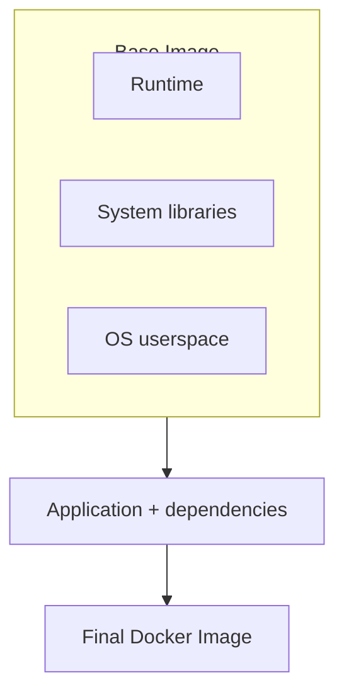
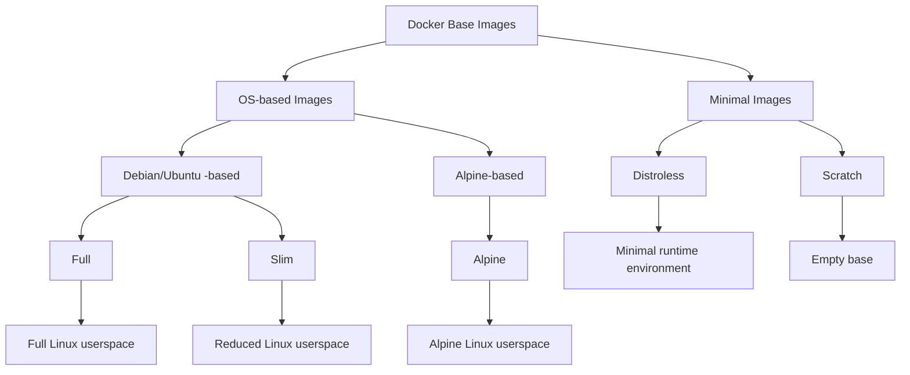

# Images de base Docker expliquées : guide complet — Partie I

Vous avez probablement vu cette ligne d’innombrables fois dans des Dockerfiles pour des applications Node.js :

```dockerfile

FROM node:24
```

Mais avons-nous vraiment besoin de `node:24` chaque fois que nous construisons une application Node.js ?

Pas forcément.

Il existe des images plus petites et plus minimales qui peuvent permettre des téléchargements d’images plus rapides, des déploiements plus légers et moins de composants à maintenir. Mais les images plus petites impliquent également des compromis — notamment en matière de compatibilité, de débogage et d’expérience de développement.

Et cela nous amène à une question plus intéressante :

****Les images Docker plus petites sont-elles réellement meilleures ?****

Dans cette série de trois articles, nous allons explorer les différents types d’images de base Docker — des images ****Full****, ****Slim**** et ****Alpine**** aux images ****Distroless**** et ****Scratch****. Nous verrons ce que chacune fournit, dans quels cas elle est pertinente et ce que vous abandonnez à mesure que vous vous dirigez vers un environnement plus minimal.

Dans ****[Partie I — Images basées sur un OS](**./../blog/docker-base-images-explained-part-1**)****, nous aborderons les images ****Full****, ****Slim**** et ****Alpine****. Nous examinerons l’environnement Linux sous-jacent de chacune, les composants qu’elle fournit et les compromis entre taille, compatibilité et simplicité d’utilisation.

Dans ****[Partie II — Images minimales](**./../blog/docker-base-images-explained-part-1**)****, nous irons au-delà des images traditionnelles basées sur un OS et explorerons ****Distroless**** et ****Scratch****. Nous verrons comment ces approches suppriment une grande partie, voire la totalité, de l’espace utilisateur traditionnel d’un système d’exploitation, et ce que cela implique en matière de compatibilité des applications, de sécurité et de débogage.

Dans ****[Partie III — Comparaison &amp; Benchmarking](**./../blog/docker-base-images-explained-part-1**)****, nous rassemblerons tous les éléments avec un ****tableau comparatif**** couvrant les cinq types d’images. Nous les mettrons ensuite à l’épreuve à travers un ****exercice de benchmarking concret****, en mesurant des indicateurs tels que ****la taille de l’image, le temps de build, le temps de démarrage et d’autres indicateurs de performance pertinents****.

Plus important encore, nous aborderons le choix du point de vue d’un ****ingénieur logiciel****. L’objectif n’est pas simplement de trouver l’image la plus petite possible, mais de répondre à une question plus utile :

> ****« Quel est l’environnement minimal dont mon application a réellement besoin ? »****

## Qu’est-ce qu’une image de base Docker ?

Avant de comparer les différents types d’images, commençons par comprendre ce qu’est réellement une ****image de base Docker****.

Lorsque vous écrivez :

```dockerfile

FROM node:24
```

vous indiquez à Docker par où commencer la construction de votre image.

Une image de base fournit le système de fichiers, les bibliothèques et les autres composants fondamentaux à partir desquels le reste de votre image est construit, y compris un runtime applicatif lorsqu’il est fourni. Dans le cas de `node:24`, elle fournit le runtime Node.js ainsi que l’espace utilisateur sous-jacent et les dépendances nécessaires à l’exécution de votre application.

À partir de là, votre Dockerfile ajoute tout ce dont votre application a besoin :



Mais c’est ici que les choses deviennent intéressantes :

****Toutes les applications n’ont pas besoin de la même quantité de composants dans leur image de base.****

Un environnement de développement peut tirer parti d’un shell, d’un gestionnaire de paquets, d’outils de débogage et d’autres utilitaires. Un conteneur de production, en revanche, peut n’avoir besoin que du runtime et des bibliothèques nécessaires à l’exécution de l’application.

C’est là qu’interviennent les différents types d’images de base.

Pour les besoins de cet article, nous pouvons regrouper approximativement les images de base Docker courantes en deux grandes catégories :

* ****Les images basées sur un OS**** fournissent un espace utilisateur Linux et incluent généralement des outils tels qu’un shell et un gestionnaire de paquets. Cette catégorie comprend les variantes Full, Slim et Alpine.
* ****Les images minimales**** adoptent une approche plus radicale en supprimant la majeure partie ou la totalité de l’espace utilisateur traditionnel. Cela inclut les images Distroless et Scratch.

Il ne s’agit pas d’une classification stricte ou universellement définie, mais elle fournit un moyen utile de comparer la quantité d’environnement qu’offre chaque type à une application.



Ces types d’images tendent généralement vers des environnements d’exécution plus petits et plus minimaux, mais ils ne constituent pas simplement des versions progressivement dépouillées les unes des autres. Chaque approche fait des compromis différents entre taille, compatibilité, outils et simplicité d’utilisation.

Plus l’image devient minimale, plus nous devons réfléchir à ****ce dont notre application a réellement besoin à l’exécution****.

Dans les sections suivantes, nous allons explorer individuellement les trois types d’images basées sur un OS, en examinant ce qu’elles contiennent, ce qu’elles excluent et, surtout, ****dans quels cas chacune est pertinente****.

## 1. Images Full

Une ****image Full**** est une image de base généraliste qui fournit un espace utilisateur Linux relativement complet ainsi que le runtime requis par votre application.

Par exemple, une application Node.js peut commencer avec :

```dockerfile

FROM node:24
```

Comparée à des images plus minimales, une ****image Full**** conserve un ensemble plus large d’outils et d’utilitaires système, ce qui facilite le développement, l’inspection et le dépannage du conteneur.

Elle comprend généralement :

* ****Un espace utilisateur Linux relativement complet****
* ****Les bibliothèques système, un shell et les utilitaires courants****
* ****Le gestionnaire de paquets du système d’exploitation**** (tel que `apt` sur les images basées sur Debian/Ubuntu)
* ****Le runtime applicatif**** (Node.js, par exemple) ainsi que son ****gestionnaire de paquets**** associé (npm, par exemple)

Dans le cas d’une image Node.js, vous pouvez vous attendre à trouver le runtime Node.js ainsi qu’un environnement sous-jacent basé sur Debian et les bibliothèques système et utilitaires qui lui sont associés.

Cela rend le conteneur beaucoup plus proche d’un environnement Linux traditionnel. Vous pouvez ouvrir un shell interactif :

```bash

docker exec -it my-app sh
```

et utiliser des outils familiers pour inspecter les fichiers, vérifier les processus, examiner les logs, installer des paquets ou résoudre directement des problèmes à l’intérieur du conteneur.

### Avantages

Le principal avantage d’une ****image Full**** est la ****simplicité d’utilisation****. Elle fournit un environnement familier et bien équipé avec la plupart des composants dont les développeurs ont généralement besoin.

* Un environnement Linux familier avec une large compatibilité pour les applications et leurs dépendances
* Un débogage et un dépannage interactifs facilités
* Une installation facile de paquets et d’outils supplémentaires
* Moins de problèmes de compatibilité lorsque les applications attendent des composants système standards

### Inconvénients

Cette simplicité a un coût. Inclure un grand nombre de composants et d’utilitaires système peut rendre l’image plus lourde que nécessaire pour la production.

* Une image plus volumineuse, entraînant davantage de données à transférer et potentiellement des temps de build, de push et de pull plus longs
* Davantage de paquets et de composants inutiles à maintenir et potentiellement à mettre à jour
* Une surface d’attaque potentiellement plus importante en raison de la présence de composants supplémentaires

En d’autres termes, une ****image Full**** vous offre un environnement confortable et flexible, mais vous pouvez finir par déployer — et maintenir — bien plus de composants que ce dont votre application a réellement besoin.

### Cas d’utilisation

Les images Full sont particulièrement adaptées à :

* ****Le développement local****
* ****Le débogage et le dépannage****
* Les applications avec des ****dépendances système complexes****
* Les applications pour lesquelles la ****compatibilité est une priorité****
* Les situations où les dépendances requises à l’exécution ne sont ****pas encore parfaitement connues****

Elles fournissent un environnement confortable et flexible pendant que vous développez, testez et dépannez votre application.

En production, une image Full peut également constituer un choix raisonnable lorsque vous ****avez besoin de la flexibilité d’un environnement Linux relativement complet**** ou lorsque la simplicité offerte par la présence d’outils courants l’emporte sur les avantages d’une image plus petite.

Cependant, une fois que les dépendances de votre application sont bien comprises, nombre de ces composants supplémentaires peuvent ne plus être nécessaires.

Cela soulève la question suivante :

> ****Et si nous conservions la compatibilité et la simplicité d’utilisation, tout en supprimant certains composants inutiles ?****

C’est là qu’interviennent les ****images Slim****.

## 2. Images Slim

Une ****image Slim**** est une variante réduite d’une image Full. Elle conserve les composants essentiels nécessaires à l’exécution de l’application tout en supprimant de nombreux paquets, outils et fichiers qui ne sont pas nécessaires à l’exécution.

Par exemple, au lieu de : `FROM node:24`, vous pouvez utiliser :

```dockerfile

FROM node:24-slim
```

L’idée est simple : ****conserver le runtime et ce dont il a besoin, tout en supprimant autant de composants inutiles que possible.****

Une ****image Slim**** contient généralement :

* ****Un espace utilisateur Linux****
* ****Les bibliothèques système et utilitaires essentiels****, avec de nombreux outils de développement et de débogage supprimés
* ****Le gestionnaire de paquets du système d’exploitation**** (tel que `apt` sur les images basées sur Debian/Ubuntu)
* ****Le runtime applicatif**** (Node.js, par exemple) et le ****gestionnaire de paquets**** (npm, par exemple)

Comparée à une ****image Full****, une image Slim contient beaucoup moins de paquets et d’utilitaires, ce qui permet d’obtenir une image plus petite tout en conservant les composants essentiels nécessaires à l’exécution de l’application.

Contrairement aux types d’images plus petites, une ****image Slim**** fournit toujours un environnement Linux conventionnel. Elle inclut généralement un shell et le gestionnaire de paquets de la distribution, ce qui facilite l’inspection, le dépannage et l’installation de paquets supplémentaires lorsque cela est nécessaire.

### Avantages

Le principal avantage des images Slim est qu’elles offrent un ****équilibre entre taille et simplicité d’utilisation****.

* Une image plus petite, permettant des transferts d’images plus rapides
* Un environnement Linux familier avec moins de paquets inutiles
* Une surface d’attaque plus petite qu’avec une image Full
* Généralement plus faciles à déboguer que les autres images minimales
* Une bonne compatibilité avec les applications qui s’attendent à disposer d’un espace utilisateur Linux traditionnel

### Inconvénients

Les images Slim restent toutefois loin d’être minimales.

* Plus grandes que les images Alpine ou Distroless dans de nombreux cas
* Contiennent toujours davantage d’utilitaires système à l’exécution que les images hautement minimales
* Davantage de paquets à maintenir que dans les autres images minimales
* La taille et le contenu exacts dépendent de la distribution sous-jacente et du runtime

Ainsi, bien que Slim supprime de nombreux composants inutiles, elle ne cherche pas à supprimer ****tout ce qui n’est pas strictement nécessaire**** à l’application.

### Cas d’utilisation

Les images Slim sont particulièrement utiles lorsque vous souhaitez ****réduire la taille et la surface d’attaque d’une image Full sans renoncer à la simplicité d’utilisation d’un environnement Linux traditionnel****.

Elles sont particulièrement adaptées à :

* ****Les applications de production lorsque la compatibilité est importante****
* Les applications qui ont encore besoin d’un ****environnement Linux conventionnel****
* Les applications avec des dépendances trop complexes pour un runtime hautement minimal
* Les équipes à la recherche d’un ****compromis entre Full et des images plus minimales****
* Les applications pour lesquelles le ****débogage à l’intérieur du conteneur**** reste important

Une image Slim constitue souvent une première étape pratique pour optimiser une image Docker existante. Elle permet de supprimer de nombreux composants inutiles tout en conservant un environnement familier et une large compatibilité.

En d’autres termes, vous pourriez penser :

> **"Je n’ai pas besoin de tout ce qu’il y a dans l’image Full, mais je veux quand même un environnement Linux normal."**

Mais que se passe-t-il si nous voulons aller encore plus loin ?

Au lieu de simplement supprimer des paquets d’une distribution traditionnelle, que se passe-t-il si nous commençons avec une distribution Linux conçue pour être petite dès le départ ?

C’est là qu’interviennent les ****images Alpine****.

## 3. Images Alpine

****Alpine Linux**** est une distribution Linux légère conçue avec un objectif de simplicité, de sécurité et de petite taille.

Docker fournit des variantes basées sur Alpine pour de nombreux runtimes populaires. Par exemple :

```dockerfile

FROM node:24-alpine
```

La distinction importante entre ****Slim**** et ****Alpine**** ne tient pas simplement à la quantité de logiciels qu’elles contiennent, mais à ****la distribution Linux sur laquelle elles sont basées****.

Une image Full ou Slim est généralement basée sur une distribution Linux conventionnelle telle que [Debian](https://www.debian.org/) ou [Ubuntu](https://ubuntu.com/). En revanche, ****Alpine est différente :**** elle est construite directement sur [Alpine Linux](https://alpinelinux.org/), plutôt que sur Debian, Ubuntu ou une autre distribution conventionnelle.

Une image basée sur Alpine fournit généralement :

* ****L’espace utilisateur Alpine Linux****
* ****musl libc**** au lieu de ****glibc****, couramment utilisée par Debian et Ubuntu
* ****Les utilitaires BusyBox**** pour les commandes Unix courantes
* ****Le gestionnaire de paquets `apk`**** au lieu de ****`apt`****
* ****Un shell et les utilitaires système essentiels****
* ****Le runtime applicatif**** (Node.js, par exemple)

### Avantages

Le principal avantage d’Alpine est sa ****faible empreinte tout en fournissant un environnement Linux généraliste fonctionnel****.

* ****Petite taille d’image****, permettant des pulls, transferts et déploiements plus rapides
* ****Gestion légère des paquets**** grâce à `apk`, avec un shell et les utilitaires essentiels
* ****Conçue pour être minimale****, avec moins de composants inclus par défaut et une surface d’attaque réduite
* ****Large écosystème**** d’images Alpine officielles et maintenues par la communauté
* ****Adaptée à de nombreuses charges de production**** nécessitant un environnement Linux léger

Elle constitue donc un compromis intéressant :

> ****Beaucoup plus petite qu’une image Full, tout en fournissant un environnement Linux utilisable.****

### Inconvénients

La principale considération avec Alpine est la ****compatibilité****.

Alpine utilise ****musl libc****, tandis que des distributions telles que Debian et Ubuntu utilisent généralement ****glibc****.

Cette différence peut entraîner des problèmes avec des applications ou des dépendances qui attendent glibc ou qui dépendent de binaires natifs précompilés.

Par exemple, les problèmes suivants peuvent survenir :

* Les modules Node.js natifs
* Les bibliothèques C/C++
* Les binaires précompilés
* Les packages de langages avec des extensions natives
* Les logiciels tiers qui supposent un environnement basé sur glibc

Dans certains cas, des packages de compatibilité supplémentaires peuvent être nécessaires, ce qui peut réduire en partie les avantages du choix d’Alpine.

La leçon importante est donc :

> ****Petit ne signifie pas automatiquement compatible.****

### Cas d’utilisation

Alpine est particulièrement adaptée à :

* ****Les applications compatibles avec musl****
* ****Les services de production légers****
* ****Les architectures de microservices****
* ****Les applications pour lesquelles la taille de l’image et le temps de transfert sont importants****
* ****Les charges de travail qui bénéficient toujours de la présence d’un shell et d’un gestionnaire de paquets****
* ****Les équipes à l’aise avec la gestion des dépendances spécifiques à Alpine****

Utilisez Alpine lorsque vous souhaitez un ****environnement Linux généraliste de petite taille**** et que vous avez vérifié que votre application et ses dépendances fonctionnent correctement avec musl.

Si votre application fonctionne correctement sur Alpine, elle peut constituer un excellent choix pour réduire la taille de l’image tout en conservant un environnement Linux fonctionnel.

Cependant, si vous passez plus de temps à résoudre des problèmes de compatibilité que vous n’en gagnez grâce à une image plus petite, une ****image Slim ou une autre image basée sur glibc**** peut constituer un choix plus pratique.

À ce stade, une question encore plus fondamentale se pose :

> ****Avons-nous réellement besoin d’une distribution Linux ?****

Et si nous supprimions le shell, le gestionnaire de paquets et la majeure partie de l’espace utilisateur, en ne conservant que ce dont l’application a besoin pour s’exécuter ?

C’est l’idée derrière les ****images non basées sur un OS****, que nous explorerons dans [Partie II](./../blog/docker-base-images-explained-part-1).
