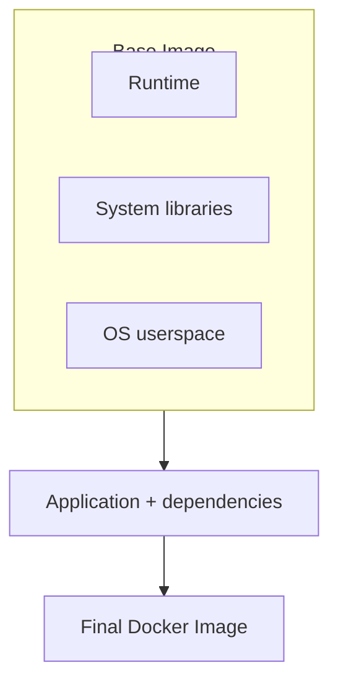
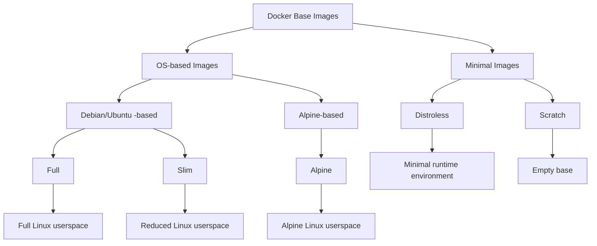

# Docker Base Images Açıklaması: Kapsamlı Bir Rehber — Bölüm I

Node.js uygulamalarına ait Dockerfile'larda bu satırı muhtemelen sayısız kez görmüşsünüzdür:

```dockerfile

FROM node:24

```

Peki bir Node.js uygulaması oluşturduğumuz her seferinde gerçekten `node:24` kullanmamız gerekiyor mu?

Belki de hayır.

Daha hızlı image çekme işlemleri, daha küçük deployment'lar ve daha az bakım gerektiren bileşenler sağlayabilecek daha küçük ve daha minimal image'lar mevcut. Ancak daha küçük image'lar bazı ödünleşimleri de beraberinde getirir — özellikle uyumluluk, debugging ve geliştirici deneyimi açısından.

Bu da bizi daha ilginç bir soruya götürüyor:

****Daha küçük Docker image'ları gerçekten daha mı iyi?****

Bu üç bölümlük seride, ****Full****, ****Slim**** ve ****Alpine**** image'lardan ****Distroless**** ve ****Scratch**** image'lara kadar farklı Docker base image türlerini inceleyeceğiz. Her birinin ne sağladığını, ne zaman kullanılmasının mantıklı olduğunu ve daha minimal bir ortama doğru ilerledikçe nelerden vazgeçtiğinizi ele alacağız.

****[Bölüm I — OS tabanlı image&#39;lar](**./../blog/docker-base-images-explained-part-1**)**** bölümünde ****Full****, ****Slim**** ve ****Alpine**** image'larını ele alacağız. Her birinin arkasındaki Linux ortamını, hangi bileşenleri sağladığını ve boyut, uyumluluk ve kullanım kolaylığı arasındaki ödünleşimleri inceleyeceğiz.

****[Bölüm II — Minimal image&#39;lar](**./../blog/docker-base-images-explained-part-1**)**** bölümünde geleneksel OS tabanlı image'ların ötesine geçerek ****Distroless**** ve ****Scratch**** image'larını inceleyeceğiz. Bu yaklaşımların geleneksel işletim sistemi userspace'inin büyük bir kısmını, hatta tamamını nasıl ortadan kaldırdığını ve bunun uygulama uyumluluğu, güvenlik ve debugging açısından ne anlama geldiğini göreceğiz.

****[Bölüm III — Karşılaştırma ve Benchmarking](**./../blog/docker-base-images-explained-part-1**)**** bölümünde ise her şeyi bir araya getirerek beş image türünün tamamını kapsayan bir ****karşılaştırma tablosu**** oluşturacağız. Ardından bunları ****somut bir benchmarking çalışması**** ile test ederek ****image boyutu, build süresi, başlangıç süresi ve diğer ilgili performans göstergeleri**** gibi metrikleri ölçeceğiz.

Daha da önemlisi, bu kararı ****bir yazılım mühendisi perspektifinden**** ele alacağız. Amaç yalnızca mümkün olan en küçük image'ı bulmak değil, daha kullanışlı bir soruya cevap vermek:

> ****“Uygulamamın gerçekten ihtiyaç duyduğu minimum ortam nedir?”****

## Docker Base Image Nedir?

Farklı image türlerini karşılaştırmadan önce, ****Docker base image'ın**** gerçekte ne olduğunu anlamakla başlayalım.

Şunu yazdığınızda:

```dockerfile

FROM node:24

```

Docker'a image'ınızı oluşturmaya nereden başlayacağını söylersiniz.

Bir base image; image'ınızın geri kalanının üzerine inşa edildiği dosya sistemini, kütüphaneleri ve diğer temel bileşenleri sağlar. Runtime sağlandığında, buna bir uygulama runtime'ı da dahildir. `node:24` örneğinde ise Node.js runtime'ını, uygulamanızı çalıştırmak için gerekli olan temel userspace'i ve bağımlılıkları sağlar.

Bundan sonra Dockerfile'ınız uygulamanızın ihtiyaç duyduğu her şeyi ekler:



Ancak işte burada işler ilginçleşiyor:

****Her uygulama base image'ında aynı miktarda bileşene ihtiyaç duymaz.****

Bir development ortamı; shell, package manager, debugging araçları ve diğer yardımcı araçlardan faydalanabilir. Öte yandan production container'ı yalnızca uygulamayı çalıştırmak için gerekli runtime ve kütüphanelere ihtiyaç duyabilir.

Farklı base image türleri de tam olarak burada devreye girer.

Bu makalenin amacı doğrultusunda, yaygın Docker base image'larını kabaca iki ana gruba ayırabiliriz:

* ****OS tabanlı image'lar**** bir Linux userspace'i sağlar ve genellikle shell ve package manager gibi araçları içerir. Bu kategori Full, Slim ve Alpine varyantlarını kapsar.
* ****Minimal image'lar**** geleneksel userspace'in büyük bir kısmını veya tamamını kaldırarak daha agresif bir yaklaşım benimser. Buna Distroless ve Scratch image'ları dahildir.

Bu, katı veya evrensel olarak tanımlanmış bir sınıflandırma değildir; ancak her image türünün bir uygulama için ne kadar çevresel bileşen sağladığını karşılaştırmak için kullanışlı bir yöntem sunar.



Bu image türleri genel olarak daha küçük ve daha minimal runtime ortamlarına doğru ilerler; ancak bunlar birbirlerinin yalnızca giderek daha fazla küçültülmüş sürümleri değildir. Her yaklaşım; image boyutu, uyumluluk, araçlar ve kullanım kolaylığı arasında farklı ödünleşimler sunar.

Image ne kadar minimal hale gelirse, ****uygulamamızın runtime sırasında gerçekte neye ihtiyaç duyduğunu**** o kadar fazla düşünmemiz gerekir.

Sonraki bölümlerde OS tabanlı image türlerinin üçünü ayrı ayrı inceleyecek; neleri içerdiklerine, neleri dışarıda bıraktıklarına ve en önemlisi, ****her birinin ne zaman mantıklı olduğuna**** bakacağız.

## 1. Full Image'lar

Bir ****Full image****, uygulamanız için gereken runtime ile birlikte nispeten eksiksiz bir Linux userspace'i sağlayan genel amaçlı bir base image'dır.

Örneğin bir Node.js uygulaması şu şekilde başlayabilir:

```dockerfile

FROM node:24

```

Daha minimal image'larla karşılaştırıldığında, bir ****Full image**** daha geniş bir sistem araçları ve yardımcı programlar kümesini korur. Bu da container'ın geliştirilmesini, incelenmesini ve sorunlarının giderilmesini kolaylaştırır.

Genellikle şunları içerir:

* ****Nispeten eksiksiz bir Linux userspace'i****
* ****System libraries, shell ve yaygın yardımcı araçlar****
* ****OS package manager**** (Debian/Ubuntu tabanlı image'larda `apt` gibi)
* ****Application runtime**** (örneğin Node.js) ve buna bağlı ****package manager**** (örneğin npm)

Bir Node.js image'ı söz konusu olduğunda, Node.js runtime'ının yanı sıra Debian tabanlı bir temel ortamı ve buna ait system libraries ve yardımcı araçları bulabilirsiniz.

Bu, container'ın geleneksel bir Linux ortamına çok daha fazla benzemesini sağlar. Etkileşimli bir shell açabilirsiniz:

```bash

docker exec -it my-app sh

```

ve container'ın içinde dosyaları incelemek, process'leri kontrol etmek, log'ları incelemek, package'lar yüklemek veya sorunları doğrudan çözmek için aşina olduğunuz araçları kullanabilirsiniz.

### Avantajları

Bir ****Full image****'ın temel avantajı ****kullanım kolaylığıdır****. Geliştiricilerin genellikle ihtiyaç duyduğu bileşenlerin çoğunu içeren tanıdık ve iyi donanımlı bir ortam sağlar.

* Uygulamalar ve bağımlılıklar için geniş uyumluluk sunan tanıdık bir Linux ortamı
* Kolay etkileşimli debugging ve troubleshooting
* Ek package ve araçların kolayca kurulabilmesi
* Uygulamalar standart system bileşenlerini beklediğinde daha az uyumluluk sorunu

### Dezavantajları

Bu kullanım kolaylığının bir maliyeti vardır. Çok sayıda system bileşeni ve yardımcı araç içermek, image'ın production için gereğinden daha büyük olmasına neden olabilir.

* Daha büyük image boyutu; daha fazla veri aktarımı ve potansiyel olarak daha uzun build, push ve pull süreleri
* Bakımı ve potansiyel olarak güncellenmesi gereken daha fazla gereksiz package ve bileşen
* Ek bileşenlerin bulunması nedeniyle potansiyel olarak daha büyük attack surface

Başka bir deyişle, bir ****Full image**** size rahat ve esnek bir ortam sağlar; ancak uygulamanızın gerçekte ihtiyaç duyduğundan çok daha fazlasını dağıtıyor ve —dolayısıyla— bakımını yapıyor olabilirsiniz.

### Kullanım Alanları

Full image'lar özellikle şunlar için uygundur:

* ****Local development****
* ****Debugging ve troubleshooting****
* ****Karmaşık system dependencies**** içeren uygulamalar
* ****Uyumluluğun öncelikli olduğu**** uygulamalar
* Gerekli runtime bağımlılıklarının ****henüz tam olarak anlaşılmadığı**** durumlar

Uygulamanızı geliştirirken, test ederken ve debug ederken rahat ve esnek bir ortam sağlarlar.

Production ortamında da bir Full image, ****nispeten eksiksiz bir Linux ortamının esnekliğine ihtiyaç duyduğunuzda**** veya yaygın araçların hazır bulunmasının sağladığı kolaylık, daha küçük bir image'ın avantajlarından daha ağır bastığında makul bir seçim olabilir.

Ancak uygulamanızın bağımlılıkları iyi anlaşıldığında, bu ek bileşenlerin çoğu artık gerekli olmayabilir.

Bu da bir sonraki soruyu ortaya çıkarıyor:

> ****Uyumluluğu ve kullanım kolaylığını koruyup gereksiz bileşenlerin bir kısmını kaldırsak ne olur?****

İşte burada ****Slim image'lar**** devreye giriyor.

## 2. Slim Image'lar

Bir ****Slim image****, Full image'ın küçültülmüş bir varyantıdır. Uygulamayı çalıştırmak için gereken temel bileşenleri korurken runtime sırasında ihtiyaç duyulmayan birçok package, araç ve dosyayı kaldırır.

Örneğin `FROM node:24` yerine şunu kullanabilirsiniz:

```dockerfile

FROM node:24-slim

```

Fikir basittir: ****runtime'ı ve onun ihtiyaç duyduğu şeyleri korurken, mümkün olduğunca fazla gereksiz yükü kaldırmak.****

Bir ****Slim image**** genellikle şunları içerir:

* ****Linux userspace****
* ****Temel system libraries ve yardımcı araçlar****, birçok development ve debugging aracı kaldırılmış şekilde
* ****OS package manager**** (Debian/Ubuntu tabanlı image'larda `apt` gibi)
* ****Application runtime**** (örneğin Node.js) ve ****package manager**** (örneğin npm)

Bir ****Full image**** ile karşılaştırıldığında Slim image önemli ölçüde daha az package ve yardımcı araç içerir. Böylece uygulamayı çalıştırmak için gereken temel bileşenleri korurken daha küçük bir image elde edilir.

Daha küçük image türlerinin aksine, bir ****Slim image**** hâlâ geleneksel bir Linux ortamı sağlar. Genellikle bir shell ve dağıtımın package manager'ını içerir; bu da gerektiğinde inceleme, troubleshooting ve ek package kurulumu işlemlerini kolaylaştırır.

### Avantajları

Slim image'ların temel avantajı ****boyut ve kullanım kolaylığı arasında bir denge**** sağlamalarıdır.

* Daha küçük image boyutu ve bunun sonucunda daha hızlı image transferleri
* Daha az gereksiz package içeren tanıdık Linux ortamları
* Full image'a göre daha küçük attack surface
* Diğer minimal image'lara göre genellikle daha kolay debugging
* Geleneksel Linux userspace'i bekleyen uygulamalarla iyi uyumluluk

### Dezavantajları

Slim image'lar hâlâ minimal değildir.

* Çoğu durumda Alpine veya Distroless image'lardan daha büyüktür
* Highly minimal image'lara kıyasla hâlâ daha fazla runtime system utility içerir
* Diğer minimal image'lara göre daha fazla package bakımı gerektirir
* Tam boyut ve içerik, temel dağıtıma ve runtime'a bağlıdır

Dolayısıyla Slim birçok gereksiz bileşeni kaldırsa da uygulama için ****kesinlikle gerekli olmayan her şeyi**** kaldırmaya çalışmaz.

### Kullanım Alanları

Slim image'lar özellikle ****geleneksel bir Linux ortamının kullanım kolaylığından vazgeçmeden Full image'ın boyutunu ve attack surface'ini azaltmak istediğinizde**** kullanışlıdır.

Şunlar için uygundur:

* ****Uyumluluğun önemli olduğu production uygulamaları****
* Hâlâ ****geleneksel bir Linux ortamına**** ihtiyaç duyan uygulamalar
* Highly minimal bir runtime için fazla karmaşık olan bağımlılıklara sahip uygulamalar
* ****Full ile daha minimal image'lar arasında bir orta yol**** arayan ekipler
* ****Container içinde debugging**** işleminin hâlâ önemli olduğu uygulamalar

Slim image, mevcut bir Docker image'ını optimize ederken genellikle pratik bir ilk adımdır. Tanıdık bir ortamı ve geniş uyumluluğu korurken birçok gereksiz bileşeni kaldırmanıza olanak tanır.

Başka bir deyişle şöyle düşünebilirsiniz:

> **"Full image'daki her şeye ihtiyacım yok ama yine de normal bir Linux ortamı istiyorum."**

Peki ya daha da ileri gitmek istersek?

Geleneksel bir dağıtımdan yalnızca package'ları kaldırmak yerine, en başından itibaren küçük olacak şekilde tasarlanmış bir Linux dağıtımıyla başlasak ne olur?

İşte burada ****Alpine image'lar**** devreye giriyor.

## 3. Alpine Image'lar

****Alpine Linux****, basitlik, güvenlik ve küçük boyut göz önünde bulundurularak tasarlanmış hafif bir Linux dağıtımıdır.

Docker, birçok popüler runtime için Alpine tabanlı varyantlar sağlar. Örneğin:

```dockerfile

FROM node:24-alpine

```

****Slim**** ile ****Alpine**** arasındaki önemli fark yalnızca içerdikleri yazılım miktarı değildir; aynı zamanda ****hangi Linux dağıtımı üzerine kurulu olduklarıdır****.

Bir Full veya Slim image genellikle [Debian](https://www.debian.org/) veya [Ubuntu](https://ubuntu.com/) gibi geleneksel bir Linux dağıtımını temel alır. Ancak ****Alpine farklıdır:**** Debian, Ubuntu veya başka bir geleneksel dağıtım yerine doğrudan [Alpine Linux](https://alpinelinux.org/) üzerine kuruludur.

Alpine tabanlı bir image genellikle şunları sağlar:

* ****Alpine Linux userspace****
* ****musl libc**** — Debian ve Ubuntu tarafından yaygın olarak kullanılan ****glibc**** yerine
* Yaygın Unix komutları için ****BusyBox yardımcı araçları****
* ****`apk` package manager**** — ****`apt`**** yerine
* ****Shell ve temel system utility'ler****
* ****Application runtime**** (örneğin Node.js)

### Avantajları

Alpine'ın temel avantajı ****işlevsel ve genel amaçlı bir Linux ortamı sağlamaya devam ederken küçük bir ayak izine sahip olmasıdır****.

* ****Küçük image boyutu**** ve bunun sonucunda daha hızlı image pull, transfer ve deployment işlemleri
* Shell ve temel utility'lerle birlikte `apk` üzerinden ****hafif package management****
* ****Minimal olacak şekilde tasarlanmıştır****; varsayılan olarak daha az bileşen içerir ve daha küçük bir attack surface sunar
* ****Geniş bir ekosistem****; resmi ve topluluk tarafından sürdürülen birçok Alpine tabanlı image
* Hafif bir Linux ortamının yeterli olduğu ****birçok production workload'u için uygundur****

Bu nedenle ilginç bir orta yol sunar:

> ****Full image'dan çok daha küçük, ancak yine de kullanılabilir bir Linux ortamı sağlar.****

### Dezavantajları

Alpine ile ilgili en önemli konu ****uyumluluktur****.

Alpine ****musl libc**** kullanırken Debian ve Ubuntu gibi dağıtımlar genellikle ****glibc**** kullanır.

Bu fark, glibc bekleyen veya önceden derlenmiş native binary'lere bağımlı olan uygulamalarda ya da bağımlılıklarda sorunlara yol açabilir.

Örneğin aşağıdaki sorunlar ortaya çıkabilir:

* Native Node.js module'leri
* C/C++ kütüphaneleri
* Önceden derlenmiş binary'ler
* Native extension'lara sahip language package'ları
* glibc tabanlı bir ortam varsayan üçüncü taraf yazılımlar

Bazı durumlarda ek compatibility package'ları gerekebilir ve bu da Alpine seçmenin avantajlarını kısmen azaltabilir.

Dolayısıyla önemli ders şudur:

> ****Küçük olması otomatik olarak uyumlu olduğu anlamına gelmez.****

### Kullanım Alanları

Alpine özellikle şunlar için uygundur:

* ****musl ile uyumlu uygulamalar****
* ****Hafif production servisleri****
* ****Microservices mimarileri****
* ****Image boyutunun ve transfer süresinin önemli olduğu uygulamalar****
* ****Hâlâ shell ve package manager bulundurmanın avantaj sağladığı workload'lar****
* ****Alpine'a özgü bağımlılıkları yönetme konusunda rahat ekipler****

Küçük bir ****genel amaçlı Linux ortamı**** istediğinizde ve uygulamanızın ve bağımlılıklarının musl ile düzgün şekilde çalıştığını doğruladığınızda Alpine kullanın.

Uygulamanız Alpine üzerinde iyi çalışıyorsa, işlevsel bir Linux ortamını korurken image boyutunu azaltmak için mükemmel bir seçim olabilir.

Ancak daha küçük image'ın sağladığı avantajlardan yararlanmaktan çok uyumluluk sorunlarını çözmeye zaman harcamaya başlarsanız, ****Slim veya başka bir glibc tabanlı image**** daha pratik bir seçim olabilir.

Bu noktada daha temel bir soru ortaya çıkıyor:

> ****Gerçekten bir Linux dağıtımına ihtiyacımız var mı?****

Shell'i, package manager'ı ve userspace'in büyük bölümünü kaldırıp yalnızca uygulamanın çalışması için ihtiyaç duyduğu şeyleri bıraksak ne olur?

Bu, ****non-OS-based image'ların**** arkasındaki fikirdir ve bunları [Bölüm II](./../blog/docker-base-images-explained-part-1) bölümünde inceleyeceğiz.
