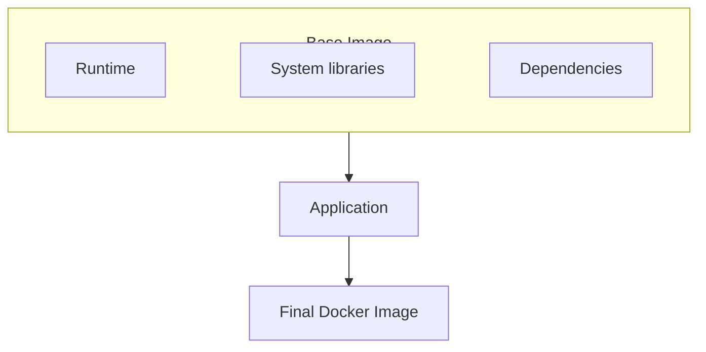
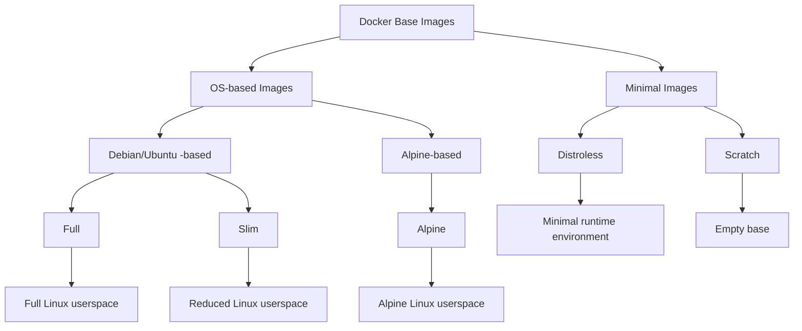

# Docker Base Images Explained: A Comprehensive Guide — Part I

You’ve probably seen this line countless times in Dockerfiles for Node.js applications:

```dockerfile
FROM node:24
```

But do we really need `node:24` every time we build a Node.js application?

Maybe not.

There are smaller and more minimal images that can provide faster image pulls, smaller deployments, and fewer components to maintain. But smaller images also come with trade-offs — particularly when it comes to compatibility, debugging, and developer experience.

And that leads to a more interesting question:

**Are smaller Docker images actually better?**

In this three-part series, we’ll take a journey through the different types of Docker base images — from **Full**, **Slim**, and **Alpine** to **Distroless** and **Scratch**. We’ll explore what each image provides, when it makes sense to use it, and what you give up as you move toward a more minimal environment.

In **Part I**, we’ll focus on **OS-based images**, covering **Full**, **Slim**, and **Alpine**. We’ll examine the Linux environment behind each image, what components it provides, and the trade-offs between size, compatibility, and convenience.

In **Part II**, we’ll move beyond traditional OS-based images and explore **Distroless** and **Scratch**. We’ll see how these approaches remove most, or even all, of the traditional operating-system userspace and what that means for application compatibility, security, and debugging.

In **Part III — Comparison & Benchmarking**, we’ll bring everything together with a **comparison table** covering all five image types. We’ll then put them to the test through a **concrete benchmarking exercise**, measuring metrics such as **image size, build time, startup time, and other relevant performance indicators**.

More importantly, we’ll approach the decision from a **software engineer’s perspective**. The goal isn’t simply to find the smallest image possible, but to answer a more useful question:

> **“What is the minimum environment my application actually needs?”**

## What Is a Docker Base Image?

Before comparing different image types, let’s first understand what a **Docker base image** actually is.

When you write:

```dockerfile
FROM node:24
```

you are telling Docker where to start building your image.

A base image provides the filesystem, libraries, and runtime environment needed by the instructions that follow. In the case of `node:24`, it gives your application a Node.js runtime together with the underlying userspace and dependencies required to run it.

From there, your Dockerfile adds everything your application needs:



But here's where things get interesting:

**Not every application needs the same amount of stuff in its base image.**

A development environment might benefit from a shell, package manager, debugging tools, and other utilities. A production container, on the other hand, may only need the runtime and the libraries required to execute the application.

This is where different types of base images come into play.

We can roughly think of them as a spectrum, going from a more complete environment to an extremely minimal one:



Each level removes something that the previous level's image provides — but that doesn't necessarily make the next image a better choice.

The more minimal the image becomes, the more we need to think about **what our application actually requires at runtime**.

In the next sections, we'll explore these five types individually, understand what they contain, what they leave out, and most importantly, **when each one makes sense.**

## 1. Full Images

A **Full image** is a general-purpose base image that provides a relatively complete Linux userspace together with the runtime required by your application.

For example, a Node.js application might start with:

```dockerfile
FROM node:24
```

Instead of providing only what is strictly necessary to run the application, a **Full image** includes a set of system tools that make the container easier to develop, inspect, and troubleshoot.

It typically includes:

* **Linux userspace**
* **System libraries, shell, and common utilities**
* **Application runtime** (Node.js, for example)
* **Package manager** (npm, for example)
* **Development and debugging tools**

For a Node.js image, for example, you can expect the Node.js runtime together with an underlying Debian-based environment and its associated system libraries and utilities.

This makes the container feel much more like a traditional Linux environment. You can open an interactive shell:

```bash
docker exec -it my-app bash
```

and use familiar tools to inspect files, check processes, examine logs, install packages, or troubleshoot issues directly inside the container.

### Advantages

The main advantage of a **Full image** is **convenience**. It provides a familiar and well-equipped environment with most of the components developers typically need.

* Familiar Linux-based environments and a broad compatibility with software and dependencies
* Convenient interactive debugging and troubleshooting
* Easy installation of additional packages and tools
* Fewer compatibility issues when applications expect standard system components

### Disadvantages

That convenience comes at a cost. Including a large set of system components and utilities can make the image heavier than necessary for production.

* Larger image size, resulting in longer build, transfer, and pull times
* More packages and dependencies to maintain and potentially update
* Larger attack surface due to the presence of additional components
* More components that may be unnecessary for running the application

In other words, a **Full image** gives you a comfortable and flexible environment, but you may end up shipping —and maintaining— far more than your application actually needs.

### When should you use it?

Full images are particularly well suited for:

* **Local development**
* **Debugging and troubleshooting**
* Applications with **complex system dependencies**
* Applications where **compatibility is a priority**
* Situations where the required runtime dependencies are **not yet fully understood**

They provide a comfortable and flexible environment while you're building, testing, and troubleshooting your application.

In production, a Full image can still be a reasonable choice when you **need the flexibility of a complete Linux environment** or when the convenience of having common tools readily available outweighs the benefits of a smaller image.

However, once your application's dependencies are well understood, many of these additional components may no longer be necessary.

That raises the next question:

> **What if we keep the compatibility and convenience, but remove some of the unnecessary components?**

That's where **Slim images** come in.

## 2. Slim Images

### What is it?

A **Slim image** is a reduced version of a Full image. It keeps the core components needed to run the application while removing many packages, tools, and files that are not required at runtime.

For example, instead of:

```dockerfile
FROM node:24
```

you can use:

```dockerfile
FROM node:24-slim
```

The idea is simple: **keep the runtime and what it needs, remove as much unnecessary baggage as possible.**

A **Slim image** typically includes:

* **Linux userspace**
* **Essential system libraries and utilities**, with many development and debugging tools removed
* **Application runtime** (Node.js, for example)
* **Package manager** (npm, for example)
* **Minimal runtime dependencies**

Compared with a **Full image**, a Slim image contains significantly fewer packages and utilities, resulting in a smaller image size while retaining the essential components needed to run the application.

Unlike smaller image types, a **Slim image** still provides a conventional Linux environment. It typically includes a shell and the distribution’s package manager, making it easier to inspect, troubleshoot, and install additional packages when needed.

### Advantages

The main advantage of Slim images is that they provide a **balance between size and convenience**.

* Smaller size than Full images resulting in a faster transfer time
* Familiar Linux-based environments with fewer unnecessary packages
* Smaller attack surface than a Full image
* Generally easier to debug than other minimal images
* Good compatibility with applications expecting a traditional Linux userspace

### Disadvantages

Slim images are still not minimal.

* Larger than Alpine or Distroless images in many cases
* Still contain unnecessary runtime system utilities
* More packages to maintain than other minimal images
* The exact size and contents depend on the underlying distribution and runtime

So while Slim removes a lot of unnecessary components, it doesn't try to remove **everything** that isn't strictly required by the application.

### When should you use it?

Slim images are particularly useful when you want to **reduce the size and attack surface of a Full image without giving up the convenience of a traditional Linux environment**.

They are well suited for:

* **Production applications where compatibility matters**
* Applications that still need a **conventional Linux environment**
* Applications with dependencies that are too complex for a highly minimal runtime
* Teams looking for a **middle ground between Full and more minimal images**
* Applications where **debugging inside the container** is still important

A Slim image is often a practical first step when optimizing an existing Docker image. It allows you to remove many unnecessary components while retaining a familiar environment and broad compatibility.

In other words, you might think:

> *"I don't need everything in the Full image, but I still want a normal Linux environment."*

But what if we want to go even further?

Instead of simply removing packages from a traditional distribution, what if we start with a Linux distribution designed to be small from the beginning?

That's where **Alpine images** come in.

## 3. Alpine Images

**Alpine Linux** is a lightweight Linux distribution designed with simplicity, security, and small size in mind.

Docker provides Alpine-based variants for many popular runtimes. For example:

```
FROM node:24-alpine
```

The important distinction between **Slim** and **Alpine** is not simply how much software they contain, but  **what Linux distribution they are built on** .

A **Full** or **Slim** image can be built on top of a conventional Linux distribution such as [Debian](https://www.debian.org/) or [Ubuntu](https://ubuntu.com/). However, **Alpine is different:** an Alpine-based image is built directly on [Alpine Linux](https://alpinelinux.org/) itself, rather than on Debian, Ubuntu, or another conventional distribution.

An Alpine-based image typically provides:

* **Alpine Linux userspace**
* **musl libc** instead of **glibc**, commonly used by Debian and Ubuntu
* **BusyBox utilities** for common Unix commands
* **`apk` package manager** instead of **`apt`**
* **Shell and essential system utilities**
* **Application runtime** (for example Node.js)

### Advantages

The main advantage of Alpine is its **small footprint while still providing a functional, general-purpose Linux environment**.

* **Small image size**, resulting in faster image pulls, transfers, and deployments
* **Lightweight package management** through `apk`, along with a shell and essential Unix utilities
* **Minimal and security-oriented by design**, with fewer components included by default
* **Wide ecosystem** of official and community-maintained Alpine-based images
* **Suitable for many production workloads** where a lightweight Linux environment is sufficient

It therefore provides an interesting middle ground:

> **Much smaller than a Full image, while still giving you a usable Linux environment.**

### Disadvantages

The biggest consideration with Alpine is **compatibility**.

Alpine uses **musl libc**, while distributions such as Debian and Ubuntu generally use **glibc**.

This difference can cause problems with applications or dependencies that expect glibc or rely on precompiled native binaries.

For example, the following issues can arise:

* Native Node.js modules
* C/C++ libraries
* Precompiled binaries
* Language packages with native extensions
* Third-party software that assumes a glibc-based environment

In some cases, additional compatibility packages may be required, which can partially offset the benefits of choosing Alpine in the first place.

So the important lesson is:

> **Small does not automatically mean compatible.**

### When should you use it?

Alpine is particularly well suited for:

* **Applications that are compatible with musl**
* **Lightweight production services**
* **Microservices architectures**
* **Applications where image size and transfer time are important**
* **Workloads that still benefit from having a shell and package manager**
* **Teams comfortable managing Alpine-specific dependencies**

Use Alpine when you want a **small, general-purpose Linux environment** and you have verified that your application and its dependencies work correctly with musl.

If your application works well on Alpine, it can be an excellent choice for reducing image size while retaining a functional Linux environment.

However, if you start spending more time solving compatibility issues than benefiting from the smaller image, a **Slim or another glibc-based image** may be a more practical choice.

At this point, an even more fundamental question arises:

> **Do we actually need a Linux distribution at all?**

What if we remove the shell, package manager, and most of the userspace, keeping only what the application needs to run?

That’s the idea behind **non-OS-based images**, which we’ll explore in [Part II](./../blog/docker-base-images-explained-part-2).
