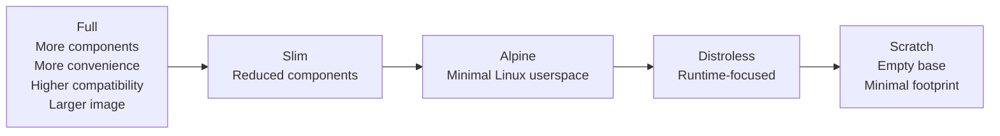

# Docker Base Images Explained: A Comprehensive Guide — Part III

Continuing our journey through Docker base images, [Part I](/blog/docker-base-images-explained-part-1) explored **OS-based images** — **Full**, **Slim**, and **Alpine** —, while Part II explored minimal images - distroless and empty- along with their advantages, trade-offs, and best use cases.

We ended up with the key question a software enginneer must ask each time:

> **“What is the minimum environment my application actually needs to run?”**

For some applications, that minimum may be a **Full** Linux userspace. For others, it may be **Slim** or **Alpine**. For a statically compiled binary with no additional runtime requirements, it might be nothing more than **Scratch**.

And that brings us to the real goal of choosing a Docker base image: **finding the right balance between minimalism, compatibility, security, and operational simplicity.**

## Docker Base Images — Comparison

| Characteristic                 | **Full**                          | **Slim**                                       | **Alpine**                       | **Distroless**                 | **Scratch**                    |
| ------------------------------ | --------------------------------- | ---------------------------------------------- | -------------------------------- | ------------------------------ | ------------------------------ |
| **Underlying environment**     | Full Linux distribution           | Reduced Linux distribution                     | Alpine Linux                     | Minimal runtime environment    | Empty base                     |
| **Linux userspace**            | ✅ Full                            | ✅ Reduced                                      | ✅ Minimal                        | ❌ No general-purpose userspace | ❌ None                         |
| **Shell**                      | ✅                                 | ✅                                              | ✅                                | ❌                              | ❌                              |
| **Package manager**            | ✅                                 | ✅                                              | ✅`apk`                           | ❌                              | ❌                              |
| **Common utilities**           | ✅ Many                            | ⚠️ Limited                                      | ⚠️ Limited                        | ❌                              | ❌                              |
| **Application runtime**        | ✅                                 | ✅                                              | ✅                                | ✅*                             | ❌*                             |
| **System libraries**           | ✅ Many                            | ✅ Required                                     | ✅ Required                       | ✅ Required                     | ❌*                             |
| **Image size**                 | 🔴 Largest                         | 🟠 Large                                        | 🟢 Small                          | 🟢 Very small                   | 🟢 Minimal                      |
| **Compatibility**              | 🟢 Highest                         | 🟢 High                                         | 🟠 Medium                         | 🟠 Depends on runtime           | 🔴 Lowest                       |
| **Debugging inside container** | 🟢 Easy                            | 🟢 Easy                                         | 🟢 Relatively easy                | 🔴 Difficult                    | 🔴 Very difficult               |
| **Attack surface**             | 🔴 Largest                         | 🟠 Reduced                                      | 🟢 Small                          | 🟢 Very small                   | 🟢 Minimal                      |
| **Build complexity**           | 🟢 Low                             | 🟢 Low                                          | 🟠 Medium                         | 🟠 Medium                       | 🔴 High                         |
| **Runtime responsibility**     | 🟢 Low                             | 🟢 Low                                          | 🟠 Medium                         | 🟠 High                         | 🔴 Very high                    |
| **Typical use**                | Development, complex applications | Production, compatibility-focused applications | Lightweight production workloads | Production microservices       | Static/self-contained binaries |

> * **Distroless** images include the runtime and libraries required by the specific image variant. **Scratch** provides none; everything required by the application must be included explicitly.

### The Overall Progression

The five approaches can be viewed as a spectrum, moving from a **fully equipped Linux environment** toward an **empty runtime base**:

The progression is not simply **“better → worse.”** Each step removes components and reduces the image footprint, but also reduces convenience and may introduce additional compatibility and operational considerations.

The goal is therefore not to choose the smallest image possible, but to find the **minimum environment your application actually needs to run reliably**.

## Benchmarking

The conceptual comparison can then be followed by actual measurements:

| Metric                 | **Full** | **Slim** | **Alpine** | **Distroless** | **Scratch** |
| ---------------------- | -------: | -------: | ---------: | -------------: | ----------: |
| **Image size**         |        — |        — |          — |              — |           — |
| **Compressed size**    |        — |        — |          — |              — |           — |
| **Build time**         |        — |        — |          — |              — |           — |
| **Pull time**          |        — |        — |          — |              — |           — |
| **Startup time**       |        — |        — |          — |              — |           — |
| **Number of packages** |        — |        — |          — |              — |           — |
