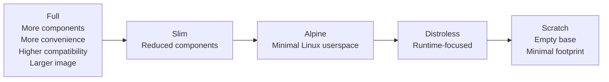

# Docker Base Images Explained: A Comprehensive Guide — Part III

Continuing our journey through Docker base images, [Part I](/blog/docker-base-images-explained-part-1) explored **OS-based images** — **Full**, **Slim**, and **Alpine** — while [Part II](/blog/docker-base-images-explained-part-2) focused on more minimal options: **Distroless** and **Scratch**, along with their advantages, trade-offs, and typical use cases.

We ended up with a question that is worth asking whenever we choose a base image:

> **“What is the minimum environment my application actually needs to run?”**

For some applications, that minimum may be a **Full** Linux userspace. For others, it may be **Slim** or **Alpine**. For a statically compiled binary with no additional runtime requirements, it might be nothing more than **Scratch**.

The goal is not simply to choose the smallest image possible. It is about finding the right balance between **minimalism, compatibility, security, and operational simplicity**.

## Docker Base Images — Comparison

The following table summarizes the main differences between the five image types.

| Characteristic             | **Full**                          | **Slim**                                       | **Alpine**                       | **Distroless**               | **Scratch**                       |
| -------------------------- | --------------------------------- | ---------------------------------------------- | -------------------------------- | ---------------------------- | --------------------------------- |
| **Underlying environment** | Full Linux distribution           | Reduced Linux distribution                     | Alpine Linux                     | Minimal runtime environment  | Empty base                        |
| **Linux userspace**        | Full                              | Reduced                                        | Minimal                          | No general-purpose userspace | None                              |
| **Shell**                  | Available                         | Available                                      | Available                        | Not available                | Not available                     |
| **Package manager**        | `apt`, `dnf`                      | `apt`, `dnf`                                   | `apk`                            | Not available                | Not available                     |
| **Common utilities**       | Many                              | Limited                                        | Limited                          | None                         | None                              |
| **Application runtime**    | Available                         | Available                                      | Available                        | Available                    | Not available                     |
| **System libraries**       | Many                              | Reduced set                                    | Required libraries               | Required libraries           | None                              |
| **Typical use**            | Development, complex applications | Production, compatibility-focused applications | Lightweight production workloads | Production microservices     | Static or self-contained binaries |

> * **Distroless** images include the runtime and libraries required by the specific image variant. **Scratch** provides nothing and everything required by the application must be included explicitly.

### Comparing the Trade-offs

The differences between these image types are not limited to their contents or size. Moving toward a more minimal image also affects **compatibility, debugging, attack surface, build complexity, and runtime responsibility**.

The diagram below summarizes these trade-offs across the five approaches.

There is no universally better option. A **Full** image provides more tools and a familiar environment, while **Distroless** and **Scratch** remove most of the components that are not required at runtime.

The right choice depends on what the application needs and how the container will be built, deployed, and operated.

### The Overall Progression

The five approaches can be viewed as a spectrum, moving from a **fully equipped Linux environment** toward an **empty runtime base**:

This progression is not simply **“better → worse.”** Each step removes components and reduces the image footprint, but it can also reduce convenience and introduce additional compatibility or operational considerations.

More importantly, these steps provide a practical way to approach image optimization.

You do not necessarily have to move directly from a **Full** image to **Alpine**, **Distroless**, or **Scratch**. In many cases, it is safer to optimize progressively:

**Full → Slim → Alpine → Distroless → Scratch**

At each step, you can verify that the application still builds and runs correctly before moving to the next level.

For example, if a Full image is much larger than necessary, **Slim** can be a natural first step. If the application works correctly with the reduced environment, you can then evaluate **Alpine**. For applications that do not require a shell or general-purpose userspace at runtime, **Distroless** may be the next option.

This approach makes optimization easier to measure and troubleshoot. If something breaks after moving from Full to Slim, the change is relatively small and the cause is easier to identify than when several layers of the environment are removed at once.

The objective is therefore not to reach **Scratch** at all costs. It is to stop at the point where the image is sufficiently minimal without making the application unnecessarily difficult to build, debug, or operate.

## Benchmarking

The conceptual comparison can then be followed by actual measurements.

Rather than relying only on theoretical differences, benchmarking the different images gives us a better idea of the practical impact of each choice.

| Metric                 | **Full** | **Slim** | **Alpine** | **Distroless** | **Scratch** |
| ---------------------- | -------: | -------: | ---------: | -------------: | ----------: |
| **Image size**         |        — |        — |          — |              — |           — |
| **Compressed size**    |        — |        — |          — |              — |           — |
| **Build time**         |        — |        — |          — |              — |           — |
| **Pull time**          |        — |        — |          — |              — |           — |
| **Startup time**       |        — |        — |          — |              — |           — |
| **Number of packages** |        — |        — |          — |              — |           — |

These measurements will help determine whether reducing the base image actually provides a meaningful improvement for the application.

Image size, for example, can affect registry storage and transfer time, while the number of packages gives an indication of how much software is present in the final image. Build and startup times can also reveal whether changing the base image has any measurable effect on the development or deployment workflow.

## Conclusion

Choosing a Docker base image is a trade-off rather than a race toward the smallest possible image.

A **Full** image provides convenience and compatibility. **Slim** reduces unnecessary components while keeping a familiar environment. **Alpine** offers a smaller Linux userspace, while **Distroless** removes most of the tools that are not needed at runtime. **Scratch** takes the idea to its extreme by providing an empty base.

For optimization, it is often better to move gradually rather than making a large jump. Starting with the current image, testing a smaller alternative, measuring the result, and verifying compatibility provides a much safer path toward a minimal production image.

In the end, the best base image is not necessarily the smallest one. It is the **smallest image that provides everything your application needs to run reliably**.
