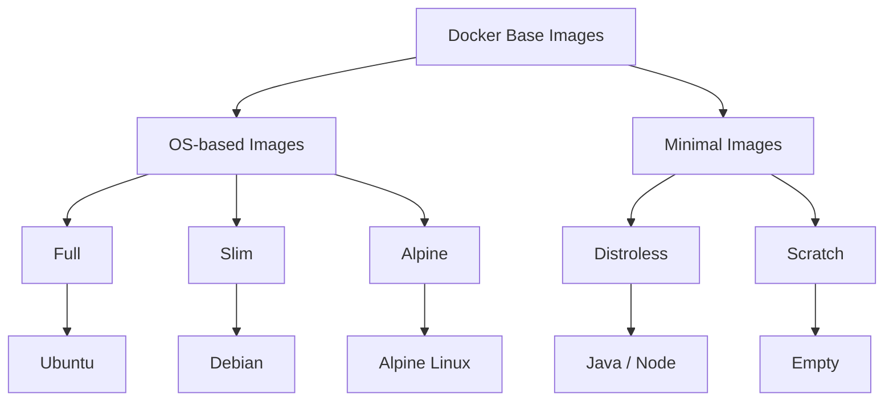

# Docker Base Images Explained: A Comprehensive Guide

You’ve probably seen this line countless times in Dockerfiles for Node.js applications: `FROM node:24`.

But do we really need `node:24` every time we build a Node.js application?

Maybe not. There are smaller images that can mean faster pulls, smaller deployments, and fewer components to maintain. But smaller also comes with trade-offs — especially when it comes to compatibility, debugging, and developer experience.

And that leads to a more interesting question: Are smaller Docker images actually better?

In this article, we’ll take a journey through the different types of Docker base images — from **Full**, **Slim**, and **Alpine** to **Distroless** and **Scratch** — and explore what each one provides, when it makes sense to use it, and what you give up as you move toward a more minimal image.

More importantly, we’ll approach the decision from a **software engineer’s perspective**: not by asking *“What is the smallest image I can use?”*, but rather:

> **“What is the minimum environment my application actually needs?”**

## What Is a Docker Base Image?

Before comparing different image types, let’s first understand what a **Docker base image** actually is.

When you write:

```dockerfile
FROM node:24
```

you are telling Docker where to start building your image.

A base image provides the filesystem, libraries, and runtime environment needed by the instructions that follow. In the case of `node:24`, it gives your application a Node.js runtime together with the underlying userspace and dependencies required to run it.

From there, your Dockerfile adds everything your application needs:

```text
Base Image
    │
    ├── Runtime
    ├── System libraries
    ├── Dependencies
    │
    ▼
Application
    │
    ▼
Final Docker Image
```

But here's where things get interesting:

**Not every application needs the same amount of stuff in its base image.**

A development environment might benefit from a shell, package manager, debugging tools, and other utilities. A production container, on the other hand, may only need the runtime and the libraries required to execute the application.

This is where different types of base images come into play.

We can roughly think of them as a spectrum, going from a more complete environment to an extremely minimal one:



Each step removes something that the previous image provides — but that doesn't necessarily make the next image a better choice.

The more minimal the image becomes, the more we need to think about **what our application actually requires at runtime**.

In the next sections, we'll explore these five approaches individually, understand what they contain, what they leave out, and most importantly, **when each one makes sense.**

## 1. Full Images

A **Full image** is a general-purpose base image that provides a relatively complete Linux userspace together with the runtime required by your application.

For example, a Node.js application might start with:

```dockerfile
FROM node:24
```

Instead of providing only what is strictly necessary to run the application, a Full image includes many common tools and system components that make the environment easier to develop, inspect, and troubleshoot.

### What does it contain?

A Full image typically contains:

```text
Full Image
│
├── Linux userspace
├── System libraries
├── Application runtime
├── Package manager
├── Shell
├── Common utilities
└── Additional system packages
```

For a Node.js image, for example, you can expect the Node.js runtime together with the underlying Debian-based environment and its associated system tools and libraries.

This means you can interact with the container much like you would with a regular Linux environment:

```bash
docker exec -it my-app bash
```

and use familiar tools to inspect or troubleshoot the application.

### Advantages

The main advantage of a Full image is **convenience**.

* Broad compatibility with software and dependencies
* Easy to install additional packages
* Familiar Linux environment
* Convenient interactive debugging
* Useful development tools and utilities are readily available
* Fewer surprises when an application expects standard Linux components

### Disadvantages

That convenience comes with a cost.

* Larger image size
* More packages and dependencies
* More components that need to be maintained and patched
* Larger attack surface
* Longer image transfer and pull times
* Many included tools may never be used by the application at runtime

In other words, you may be shipping a lot more than your application actually needs.

### Best use cases

Full images are particularly well suited for:

* **Local development**
* **Debugging**
* Applications with complex system dependencies
* Applications where compatibility is a priority
* Situations where the required runtime dependencies are not yet fully understood

They provide a comfortable environment while you're building and troubleshooting your application.

### When should you use it?

Use a Full image when you **need the flexibility of a complete Linux environment** or when the convenience of having common tools readily available outweighs the benefits of a smaller image.

For a production application with well-understood dependencies, however, you may not need all of these additional components.

That raises the next question:

> **What if we keep the compatibility and convenience, but remove some of the unnecessary components?**

That's where **Slim images** come in.

## 2. Slim Images

### What is it?

A **Slim image** is a reduced version of a Full image. It keeps the core components needed to run the application while removing many packages, tools, and files that are not required at runtime.

For example, instead of:

```dockerfile
FROM node:24
```

you can use:

```dockerfile
FROM node:24-slim
```

The idea is simple: **keep the runtime and what it needs, remove as much unnecessary baggage as possible.**

### What does it contain?

A Slim image generally contains:

```text
Slim Image
│
├── Linux userspace
├── System libraries
├── Application runtime
├── Essential utilities
└── Required dependencies
```

Compared with a Full image, many additional packages and utilities are removed.

However, unlike a Distroless image, a Slim image still provides a conventional Linux environment. You can typically find a shell and use the distribution's package management ecosystem when necessary.

### Advantages

The main advantage of Slim images is that they provide a **balance between size and convenience**.

* Smaller than Full images
* Fewer unnecessary packages
* Reduced image size and transfer time
* Smaller attack surface than a Full image
* Still provides a familiar Linux environment
* Generally easier to debug than highly minimal images
* Good compatibility with applications expecting a traditional Linux userspace

### Disadvantages

Slim images are still not minimal.

* Larger than Alpine or Distroless in many cases
* Still contain system utilities that may not be needed at runtime
* More packages to maintain than a highly minimal image
* The exact size and contents depend on the underlying distribution and runtime

So while Slim removes a lot of unnecessary components, it doesn't try to remove **everything** that isn't strictly required by the application.

### Best use cases

Slim images are particularly useful for:

* **Production applications where compatibility matters**
* Applications that still need a conventional Linux environment
* Applications that are too complex for a highly minimal runtime
* Teams looking for a middle ground between Full and more minimal images
* Applications where debugging inside the container is still important

They are often a practical first step when optimizing an existing Docker image.

### When should you use it?

Use a Slim image when you want to **reduce the size and attack surface of a Full image without giving up the convenience of a traditional Linux environment**.

It's a good choice when you think:

> *"I don't need everything in the Full image, but I still want a normal Linux environment."*

But what if we want to go even further?

Instead of simply removing packages from a traditional distribution, what if we start with a Linux distribution designed to be small from the beginning?

That's where **Alpine images** come in.

## 3. Alpine Images

### What is it?

**Alpine Linux** is a lightweight Linux distribution designed with simplicity, security, and small size in mind.

Docker provides Alpine-based variants for many popular runtimes. For example:

```dockerfile
FROM node:24-alpine
```

Unlike a Slim image, which is essentially a reduced version of a more complete distribution, Alpine is based on **Alpine Linux itself**.

Its small footprint makes it a popular choice when developers want a lightweight container while still keeping a functional Linux environment.

### What does it contain?

An Alpine-based image typically provides:

```text
Alpine Image
│
├── Alpine Linux userspace
├── musl libc
├── BusyBox utilities
├── apk package manager
├── Shell
├── Application runtime
└── Required dependencies
```

One of the most important differences compared with Debian-based images is its use of **musl libc** instead of **glibc**.

This distinction is particularly important for applications that rely on native binaries or libraries.

### Advantages

The main advantage of Alpine is its **small footprint while still providing a general-purpose Linux environment**.

* Small image size
* Fast image pulls and deployments
* Package manager available through `apk`
* Shell and common utilities available
* Security-oriented and minimal by design
* Large ecosystem of Alpine-based Docker images
* Suitable for many production workloads

It therefore provides an interesting middle ground:

> **Much smaller than a Full image, while still giving you a usable Linux environment.**

### Disadvantages

The biggest consideration with Alpine is **compatibility**.

Alpine uses **musl libc**, while distributions such as Debian and Ubuntu generally use **glibc**.

This difference can cause problems with applications or dependencies that expect glibc or rely on precompiled native binaries.

For example, you may encounter issues with:

* Native Node.js modules
* C/C++ libraries
* Precompiled binaries
* Language packages with native extensions
* Third-party software that assumes a glibc-based environment

You may also find yourself installing additional compatibility packages, which can reduce some of the benefits of choosing Alpine in the first place.

So the important lesson is:

> **Small does not automatically mean compatible.**

### Best use cases

Alpine is particularly well suited for:

* Applications that are compatible with musl
* Lightweight production services
* Microservices
* Applications where image size and transfer time are important
* Workloads that still benefit from having a shell and package manager
* Teams comfortable managing Alpine-specific dependencies

### When should you use it?

Use Alpine when you want a **small, general-purpose Linux environment** and you have verified that your application and its dependencies work correctly with musl.

If your application works perfectly on Alpine, it can be an excellent choice.

However, if you start spending more time solving compatibility problems than benefiting from the smaller image, a Slim or another glibc-based image may be the more practical choice.

And this raises an even more fundamental question:

> **Do we actually need a Linux distribution at all?**

What if we remove the shell, package manager, and most of the userspace, keeping only what the application needs to run?

That's the idea behind **Distroless images**.

## 4. Distroless Images

### What is it?

**Distroless** images take the idea of minimal containers one step further.

Instead of starting with a general-purpose Linux distribution and removing unnecessary packages, Distroless images are designed to contain **only the runtime components and libraries needed to run an application**.

For example:

```dockerfile
FROM gcr.io/distroless/nodejs24
```

The name is intentional: **Distroless images contain no traditional Linux distribution userspace.**

However, "distroless" does **not** mean that the image contains no operating-system components at all. It still contains the libraries and files required by the application and relies on the host kernel, like any other container.

### What does it contain?

A Distroless image typically contains:

```text
Distroless Image
│
├── Required system libraries
├── Runtime
├── CA certificates / essential data
├── Application dependencies
└── Application
```

What you generally won't find is just as important:

```text
❌ Shell
❌ Package manager
❌ Common Linux utilities
❌ Compilers
❌ Development tools
```

This means that commands you might normally take for granted, such as:

```bash
sh
bash
curl
apt
apk
```

are typically not available.

### Advantages

The main advantage of Distroless is **minimalism at runtime**.

* Very small runtime images
* Fewer unnecessary components
* Reduced attack surface
* No package manager
* No shell in standard images
* Fewer packages to maintain
* Well suited to immutable production containers

The philosophy is simple:

> **If your application doesn't need it to run, don't put it in the runtime image.**

This also works particularly well with **multi-stage builds**.

You can use a full environment to build your application and then copy only the resulting artifacts into a Distroless runtime image:

```text
        Build Image
    ┌─────────────────┐
    │ Compiler        │
    │ Package manager │
    │ Build tools     │
    │ Dependencies    │
    └────────┬────────┘
             │
             │ application artifact
             ▼
    ┌─────────────────┐
    │   Distroless    │
    │                 │
    │ Runtime         │
    │ Libraries       │
    │ Application     │
    └─────────────────┘
```

### Disadvantages

The same minimalism that makes Distroless attractive can also make it less convenient.

* No shell for interactive debugging
* No package manager
* No common troubleshooting utilities
* Missing tools cannot simply be installed at runtime
* Application dependencies need to be understood beforehand
* Debugging requires different techniques and better observability

For example, this familiar command won't work with a standard Distroless image:

```bash
docker exec -it my-app sh
```

because there is no `sh` to execute.

This changes how you operate the container. Instead of relying on tools inside the container, you should rely more on **logs, metrics, traces, health checks, and external debugging techniques**.

### Best use cases

Distroless images are particularly suited for:

* **Production workloads**
* Mature applications with well-understood runtime dependencies
* Microservices
* Applications deployed through CI/CD
* Immutable container environments
* Workloads where minimizing unnecessary runtime components is a priority

They are especially interesting when combined with multi-stage builds: the build environment can contain everything required to compile the application, while the final image contains only what is needed to run it.

### When should you use it?

Use Distroless when your application has a **well-defined runtime environment** and you want to minimize the components shipped to production without maintaining a full Linux userspace.

It is a strong fit when your mindset is:

> **"Build with everything I need, but run with only what I need."**

But we can take this idea even further.

What if we don't need a runtime environment with a shell, package manager, or even standard system libraries?

What if the application is already a self-contained executable?

That's where we reach the extreme end of our spectrum: **Scratch images**.

## 5. Scratch Images

### What is it?

**Scratch** is the most minimal starting point available in Docker.

Unlike Full, Slim, Alpine, or Distroless images, `scratch` doesn't provide a Linux userspace, shell, package manager, runtime, or system utilities.

It is essentially an **empty image**.

```dockerfile
FROM scratch
```

This means Docker starts with almost nothing, and you are responsible for putting everything your application needs into the image.

### What does it contain?

By default:

```text
Scratch
│
└── Nothing
```

There is:

```text
❌ Shell
❌ Package manager
❌ Linux userspace
❌ System utilities
❌ Runtime
❌ Standard libraries
```

Your application and any files it requires must be copied into the image yourself.

For example:

```dockerfile
FROM scratch

COPY my-app /my-app

ENTRYPOINT ["/my-app"]
```

This works particularly well for applications compiled into a **self-contained static binary**.

### Advantages

Scratch provides the ultimate level of minimalism.

* Extremely small image
* Almost no unnecessary components
* Minimal attack surface
* No package manager
* No shell
* No system utilities
* Very small attack surface at the image-content level
* Excellent fit for statically compiled applications

A scratch image can essentially contain only:

```text
Application binary
       +
Required files
```

There is very little else to maintain.

### Disadvantages

That extreme minimalism comes with significant limitations.

* No shell
* No package manager
* No debugging utilities
* No runtime
* No standard userspace
* You must provide everything your application requires
* Debugging can be considerably more difficult
* Applications relying on dynamically linked libraries may not work without additional files

For example, a dynamically linked application cannot simply be copied into `scratch` and expected to work if its required libraries aren't present.

This is why Scratch is particularly associated with **statically compiled applications**.

### Best use cases

Scratch is best suited for:

* Statically compiled applications
* Small Go services
* Minimal command-line applications
* Security-sensitive production workloads where the application can run without a userspace
* Highly controlled container environments

A classic example is a statically compiled Go application:

```dockerfile
FROM golang:1.25 AS builder

WORKDIR /app

COPY . .

RUN CGO_ENABLED=0 go build -o my-app .


FROM scratch

COPY --from=builder /app/my-app /my-app

ENTRYPOINT ["/my-app"]
```

The first stage contains the Go toolchain and everything needed to build the application.

The final stage contains essentially just the resulting binary.

### When should you use it?

Use `scratch` when your application is **self-contained and does not require a traditional Linux userspace at runtime**.

It is particularly attractive when you have a statically compiled binary and want the smallest possible runtime image.

But Scratch is not simply the "best" version of Distroless.

The question is not:

> **"How small can I make my image?"**

The better question is:

> **"What is the minimum environment my application actually needs to run?"**

For some applications, that minimum may be a full Linux userspace. For others, it may be a Slim or Alpine environment. For a statically compiled binary, it might be nothing more than `scratch`.

And that brings us to the real goal of choosing a Docker base image: **finding the right balance between minimalism, compatibility, security, and operational simplicity.**
